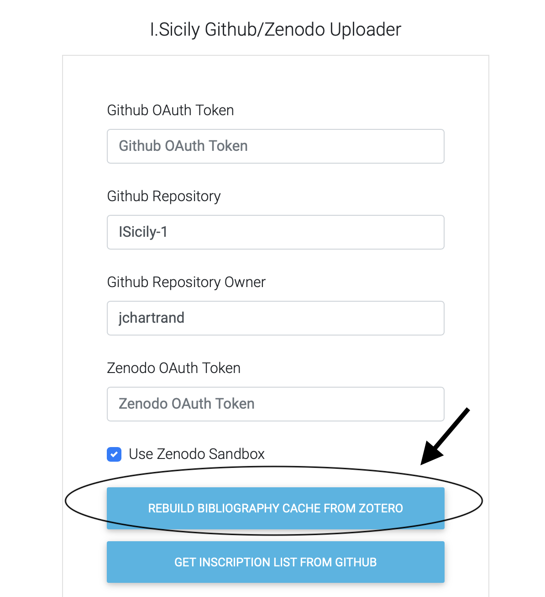

## I.Sicily Zenodo uploader

Reads TEI XML epidoc files from a Github repository, and for each file builds a PDF that describes the inscription, and then uploads the PDF and the associated TEI XML file to Zotero, in the process creating a new DOI for the file.  The new DOI is also recorded in the PDF and the TEI XML file.  The TEI XML file is saved back to the Github repository. 

1. [Images](#images)
2. [Bibliographic References](#bibliographic_references)
3. [Use](#use)

#### Images

The PDF includes any images referenced in the facsimile/surface/graphic section with attribute n='print', e.g.

```xml
 <facsimile>
        <surface type="front">
            <graphic n="screen" url="ISic0007_tiled.tif" height="2034px" width="4608px">
                <desc>Photo by Metcalfe</desc>
            </graphic>
            <graphic n="print" url="ISic0007.jpg" height="2034px" width="4608px">
                <desc>Photo by Metcalfe</desc>
            </graphic>
        </surface>
    </facsimile>
```

The images themselves must be in the images directory and must have names that match those in the TEI file, but with '_small' appended to the file name.  So, taking the example above, where
the file name in the 'url' attribute of the 'graphic' element (with attribute n="printy") is 'ISic0007.jpg', there must then be an image in the images directory called
'ISic0007_small.jpg'

 
#### Bibliographic References

The PDF also includes the bibliographic references for the inscription.  The references are taken from any TEI/text/body/div[@type=bibliography]/listBibl/bibl elements, like this one:
```XML
<bibl type="AE">
    <citedRange>1895.0023</citedRange>
    <ptr target="http://zotero.org/groups/382445/items/R46KDTZX"/>
</bibl>and uploads both the XML file and PDF to Zenodo.  
```
The zotero reference (e.g., `http://zotero.org/groups/382445/items/R46KDTZX`) is expanded (to include authors, title, etc.) on-the-fly during construction of the PDF, using a copy of the Zotero bibliography that has been downloaded and stored locally using the 'Rebuild Bibliography CAched From Zotero' button on the uploading form:



This cache must be available or the uploading will fail.  The cached file will appear in the root directory as cachedBibl.json and should be between 1 and 2 Megabytes.

#### Use

Runs directly from this Github repository, using Github pages, which publishes the repository as a web site.

To use, open:

https://jchartrand.github.io/zenodo-git-up/public/index.html

Then fill out the form with:
 
- A Github token
 
Which you can get as described here:  https://help.github.com/en/github/authenticating-to-github/creating-a-personal-access-token-for-the-command-line
  
  It has to be a token given to the owner of the repository.
  
- Your Zenodo token

which you can get as described here: 

- the name of the repository that has the TEI files

the repository has to be structured like the I.Sicily repository, with the epidoc files in an inscriptions directory:

https://github.com/JonPrag/ISicily


